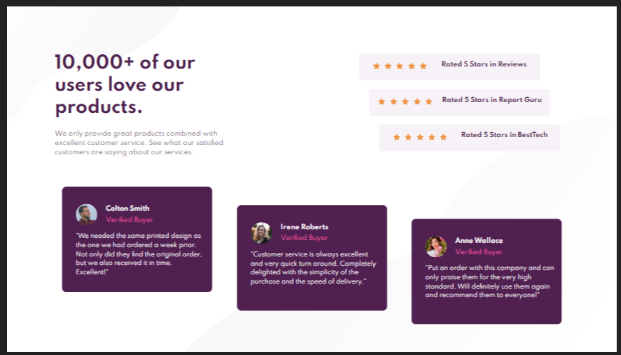

<h1 align="center">Social Proof Section</h1>

  <h3>
    <a href="https://social-proof-section-seven-iota.vercel.app/">
      Live site
    </a>
     | 
    <a href="https://www.frontendmentor.io/solutions/social-proof-section-4NWhbF9cf">
      Solution
    </a>
     | 
    <a href="https://www.frontendmentor.io/challenges/social-proof-section-6e0qTv_bA">
      Challenge
    </a>
  </h3>

   Solution for a challenge from  <a href="https://www.frontendmentor.io/" target="_blank">Frontendmentor.io</a>.

---

## Table of contents

- [Overview](#overview)
  - [Built with](#built-with)
- [Contact](#contact)

<!-- Overview section -->
## Overview
- Frontend Mentor challenges help you improve your coding skills by building realistic projects. 

- You can see a live site at [Social proof section](https://social-proof-section-seven-iota.vercel.app/)

### Built with 

- Semantic HTML5 markup
- CSS custom properties
- Flexbox
- Mobile-first workflow

<!-- Contact section -->

##  Contact

- Github Repositories [@Aman-sgz](https://github.com/Aman-sgz/)

- Frontend Mentor [@Aman-sgz](https://www.frontendmentor.io/profile/Aman-sgz)

- Twitter Aman [@Aman_arg](https://www.twitter.com/Aman_arg)  

---

    
Aman-sgz | 2021

